

## Отчет

## Практическая работа 10

## Использование аппаратных возможностей устройства. Разрешения, уведомления, вибрация, камера

---

**ФИО:** Лапшин Никита Евгеньевич  
**Курс:** 2
**Группа:** ИНС-б-о-24-1  
**Направление:** 09.03.02 «Информационные системы и технологии»  

---
### Вариант 9
### Цель работы

Изучить механизм работы с разрешениями в Android, научиться создавать уведомления (Notification), управлять вибрацией устройства, а также получать доступ к камере для предварительного просмотра изображения.

### Ход работы

  
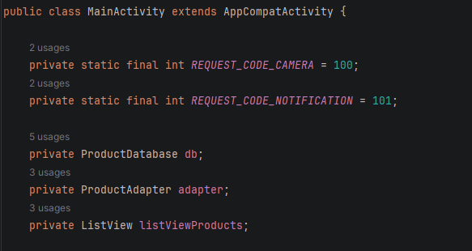

Рисунок 1 - Инициализация переменных

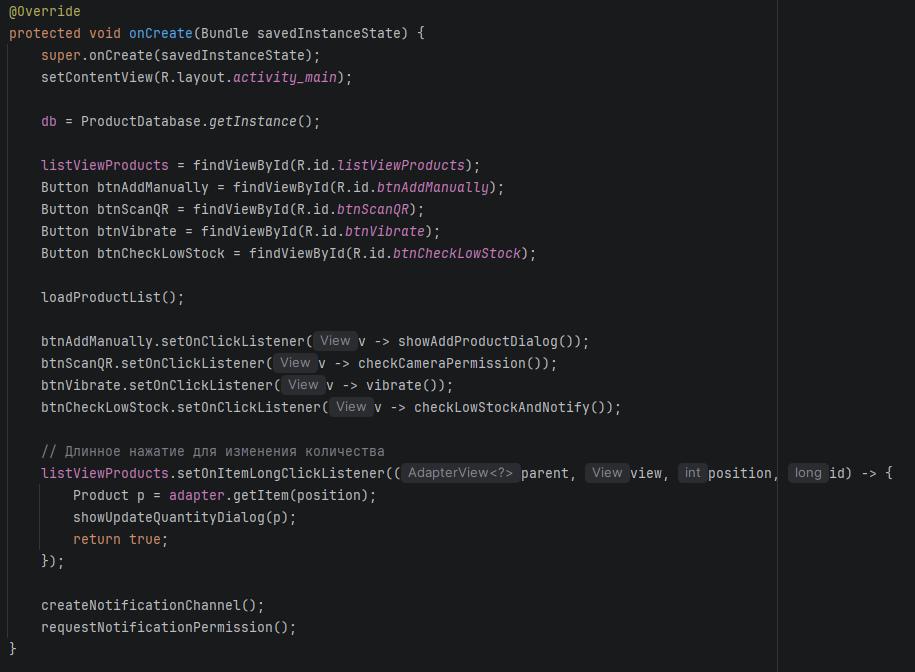

Рисунок 2 - Создание OnCreate, инициализация кнопок

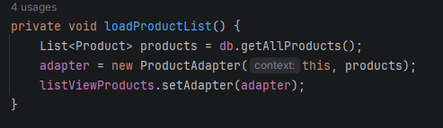

Рисунок 3 – Загрузка адаптера списка товаров

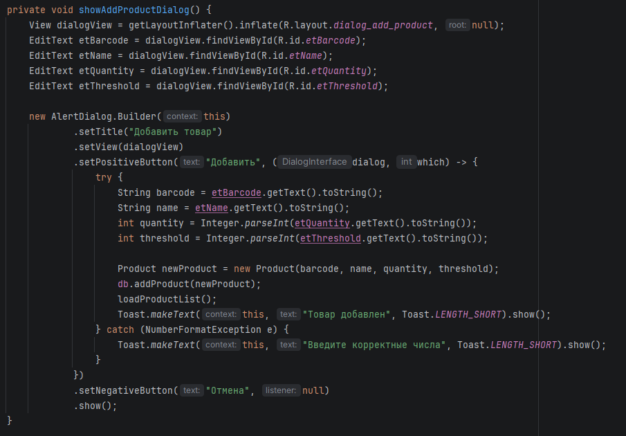

Рисунок 4 – Диалоговое окно добавления товара

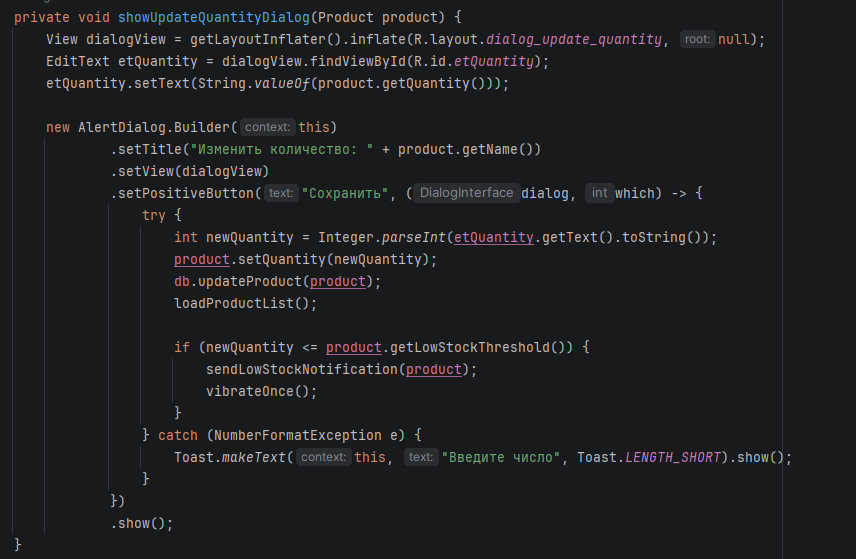

Рисунок 5 – Диалоговое окно обновления информации о товаре

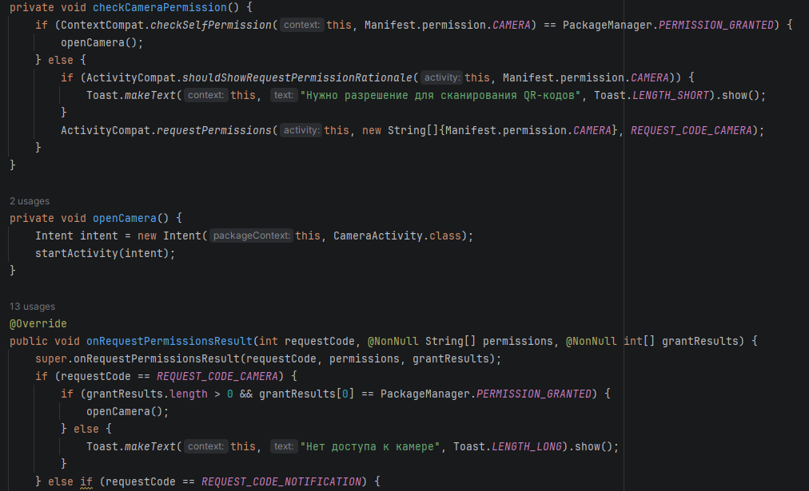

Рисунок 6 – Открытие камеры, вывод toast при ошибках

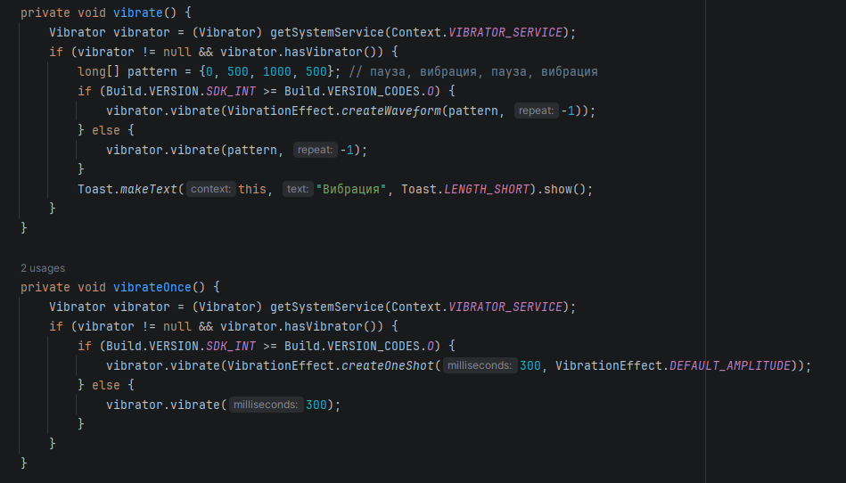

Рисунок 7 – Обработка вибрации

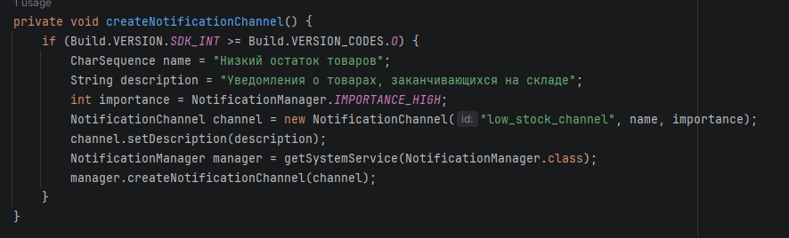

Рисунок 8 – Создание уведомления о низком кол-ве товаров

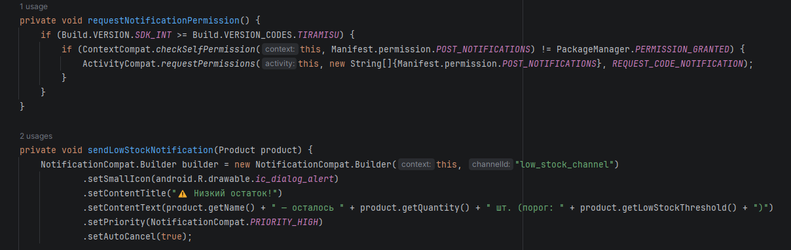

Рисунок 9 – Запрос на отправку уведомлений и отправка уведомления

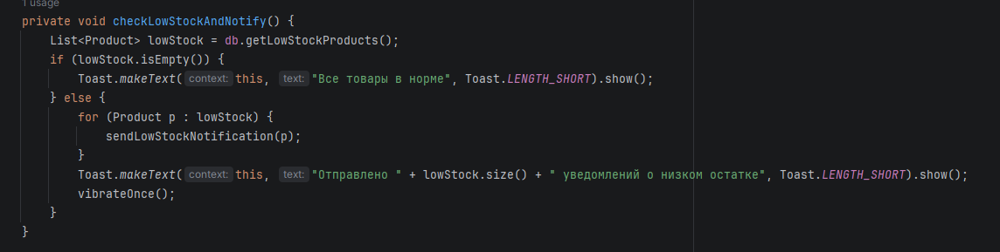

Рисунок 10 – Проверка на низкий остаток товаров

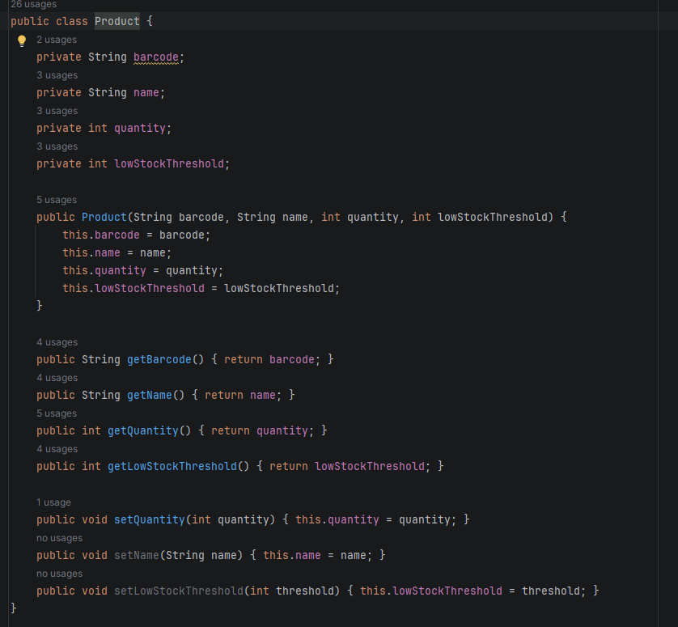

Рисунок 11 - Модель товара

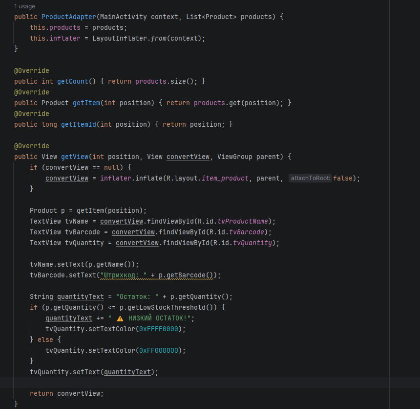

Рисунок 12 - Адаптер списка товаров

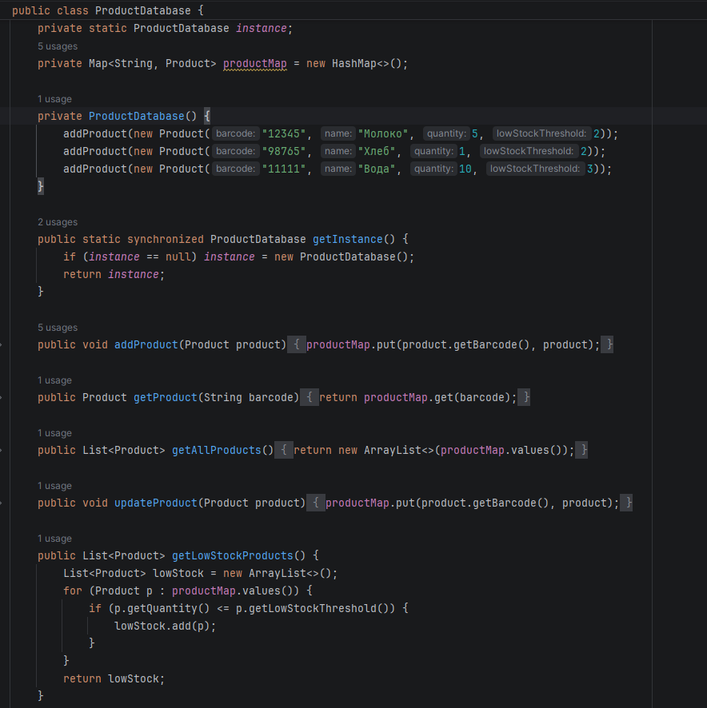

Рисунок 13 - База данных

Контрольные вопросы:
1. Нормальные разрешения (INTERNET, VIBRATE) автоматически выдаются при установке и не требуют запроса, а опасные разрешения (CAMERA, LOCATION, RECORD_AUDIO) требуют явного согласия пользователя во время выполнения через диалог.
2. Последовательность: проверить наличие через checkSelfPermission() → если нет, объяснить зачем через shouldShowRequestPermissionRationale() → вызвать requestPermissions() → переопределить onRequestPermissionsResult() и проверить результат.
3. NotificationChannel нужен для группировки уведомлений по типам, позволяет пользователю управлять настройками (звук, вибрация, важность) для каждого канала отдельно на Android 8.0+
4. Создать NotificationCompat.Builder с указанием ID канала → установить заголовок, текст, иконку → вызвать NotificationManagerCompat.notify() с уникальным ID и построенным уведомлением.
5. Методы: vibrate() и vibrate(long milliseconds) для простой вибрации; для паттерна использДля доступа к камере используются классы: Camera или Camera2, SurfaceView для предпросмотра, SurfaceHolder.Callback для управления жизненным циклом; нужно вызвать Camera.open() и setPreviewDisplay().уется vibrate(VibrationEffect.createWaveform(длинныйМассив, -1)) на Android 8+ или vibrate(длинныйМассив, -1) на старых версиях.
6. Для доступа к камере используются классы: Camera или Camera2, SurfaceView для предпросмотра, SurfaceHolder.Callback для управления жизненным циклом; нужно вызвать Camera.open() и setPreviewDisplay().
7. Приложение упадет с SecurityException (краш) или функция вернет null/не сработает, так как система блокирует доступ к защищенным ресурсам без разрешения.
8. Проверить можно через ContextCompat.checkSelfPermission(context, разрешение), который вернет PackageManager.PERMISSION_GRANTED или PackageManager.PERMISSION_DENIED.
